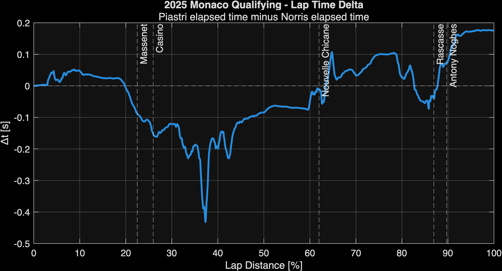
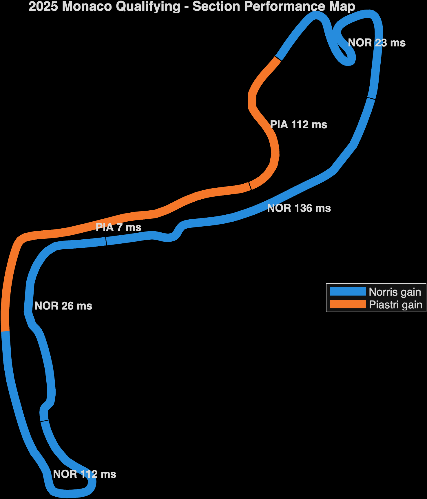
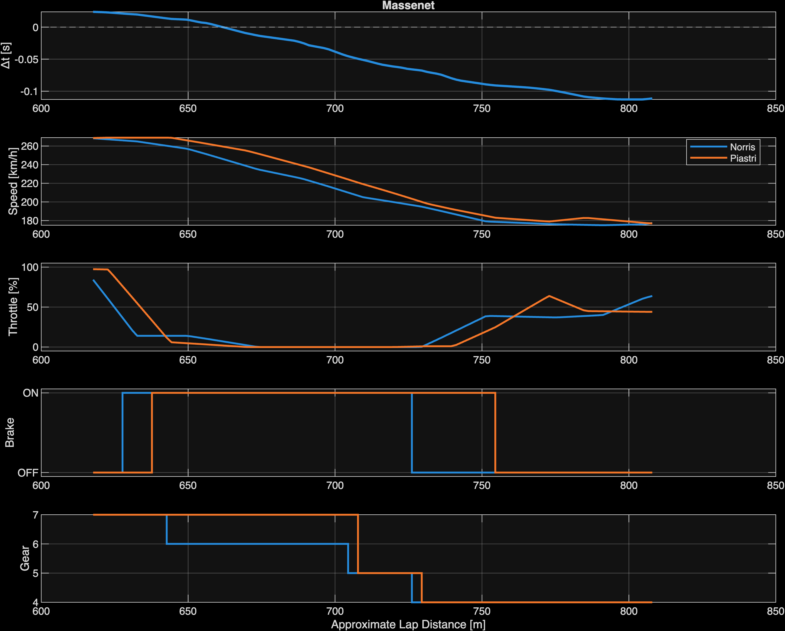
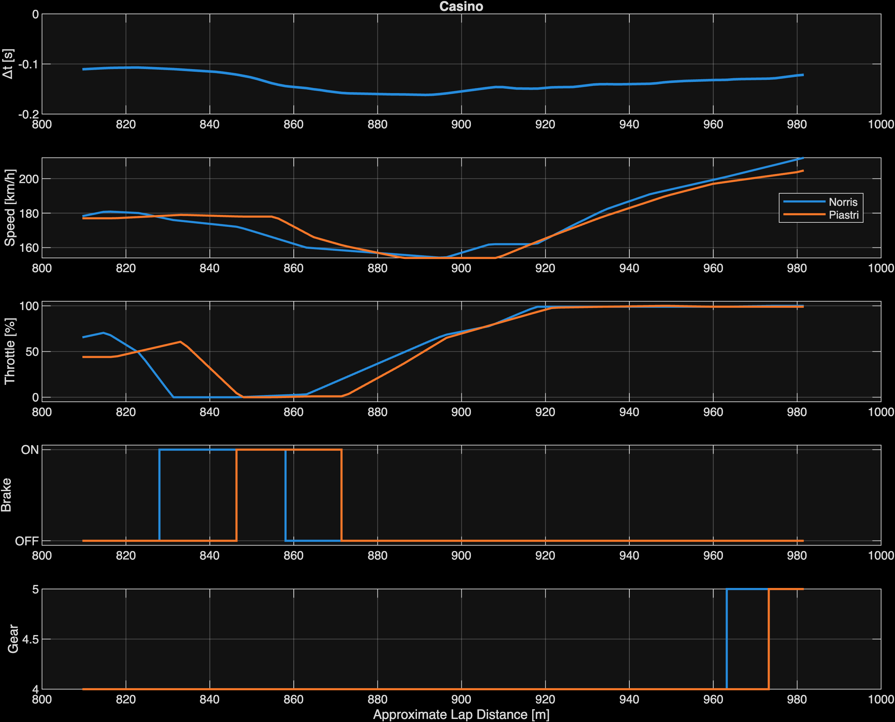
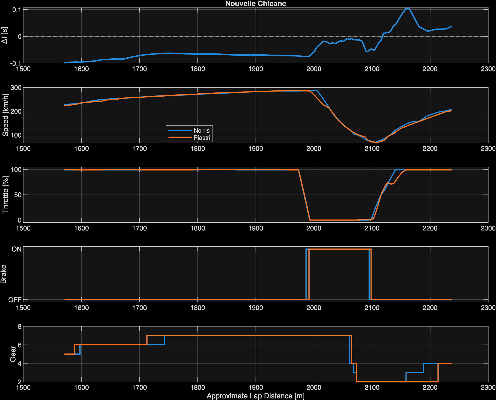
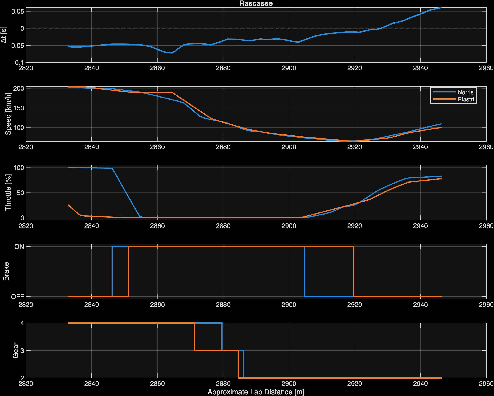
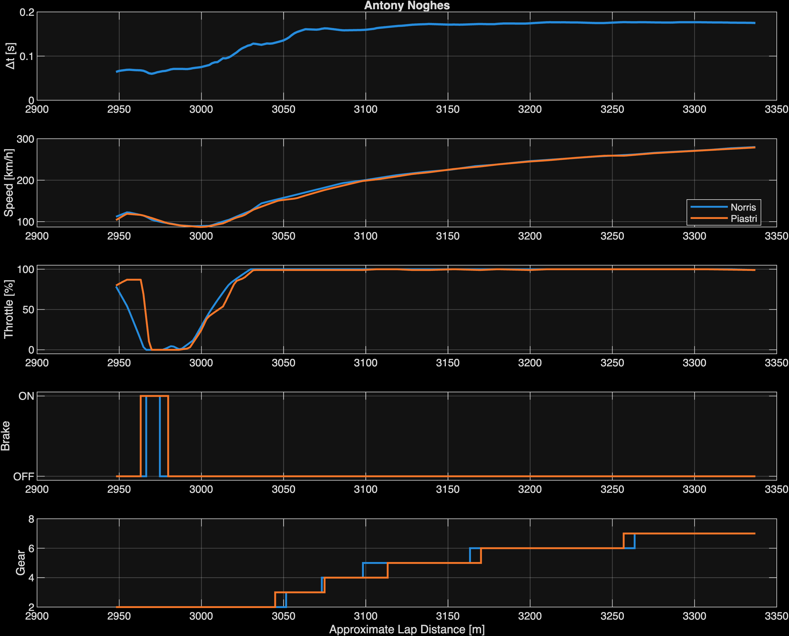

# F1 Monaco Qualifying Telemetry Analysis

## Norris vs Piastri — 2025 Monaco Grand Prix

This project uses MATLAB to analyse the fastest qualifying laps of Lando Norris and Oscar Piastri at the 2025 Monaco Grand Prix.

**Lando Norris:** 1:09.954  
**Oscar Piastri:** 1:10.129  
**Final lap-time difference:** 0.175 s

The aim of the project was to investigate **where the lap-time difference was generated and what the available telemetry suggests about the cause**.

---

## Tools and Data

The analysis was carried out in MATLAB using publicly available Formula 1 telemetry.

The channels used include:

- Speed
- Throttle position
- Brake application
- Gear
- RPM
- Position and lap distance

The telemetry was imported from JSON files and processed in MATLAB.

The publicly available brake channel is binary, so it is treated as **brake application (ON/OFF)** rather than brake pressure.

---

## Method

The two laps contained slightly different telemetry sampling and recorded distance values. To allow a direct comparison, each lap was normalised by lap progress and interpolated onto a common distance axis.

Lap-time delta was calculated as:

**Δt = Piastri elapsed time − Norris elapsed time**

Therefore:

- Positive Δt = Norris is ahead
- Negative Δt = Piastri is ahead
- Rising delta = Norris is gaining time
- Falling delta = Piastri is gaining time

The calculated delta at the end of the lap was **0.175 s**, matching the difference between the two qualifying lap times.

---

## Whole-Lap Analysis

The lap-time advantage changes significantly throughout the lap rather than being accumulated gradually.

Piastri gained a substantial advantage during the early part of the lap, particularly around Massenet and Casino. Norris subsequently recovered the deficit and ultimately finished the lap 0.175 s ahead.

---

## Section Performance

The lap was divided into major sections to investigate where each driver gained time.

| Section | Faster Driver | Approx. Difference |
|---|---|---:|
| Sainte Devote – Beau Rivage | Piastri | 7 ms |
| Massenet – Casino | Piastri | 112 ms |
| Mirabeau – Hairpin – Portier | Norris | 23 ms |
| Tunnel – Nouvelle Chicane | Norris | 136 ms |
| Tabac – Swimming Pool | Norris | 26 ms |
| Rascasse – Antony Noghes | Norris | 112 ms |

The section values describe changes within the defined analysis regions. They should not be treated simply as independent components that add directly to the final 0.175 s lap difference.

---

# Detailed Corner Analysis

## Massenet

Piastri was approximately **0.135 s faster** through the analysed Massenet section.

Piastri began braking approximately 10 m later and carried approximately 2 km/h more minimum speed. His speed trace remained higher through much of the corner despite remaining on the brake for longer.

This suggests that Piastri's gain was associated primarily with maintaining greater speed through the braking and cornering phase rather than simply accelerating earlier on exit.

---

## Casino

The drivers were much more closely matched through Casino, with Piastri approximately **0.011 s faster**.

Their minimum speeds were almost identical:

- Norris: 154.2 km/h
- Piastri: 154.0 km/h

Piastri braked later, while Norris began accelerating earlier. Despite this, the overall time difference through the section remained small.

This demonstrates why minimum speed or throttle pickup alone cannot fully explain corner performance. The complete speed profile through the section must also be considered.

---

## Nouvelle Chicane

Norris was approximately **0.136 s faster** through the analysed Tunnel–Nouvelle Chicane section.

Around the braking and exit phase:

- Norris minimum speed: 69.2 km/h
- Piastri minimum speed: 66.8 km/h
- Norris reached full throttle approximately 15 m earlier

Norris therefore carried slightly more speed through the slowest part of the chicane and returned to full throttle earlier.

The telemetry is consistent with a stronger chicane and exit phase for Norris, although the available public data does not allow the exact vehicle-dynamics cause to be determined.

---

## Rascasse

Norris was approximately **0.115 s faster** through the analysed Rascasse section.

The drivers approached the corner differently. Piastri remained on the brake for longer, while Norris released the brake earlier and carried slightly more minimum speed.

Norris also began picking up the throttle slightly earlier.

The combination of brake release, minimum speed and throttle behaviour is consistent with Norris achieving a stronger transition through the corner.

---

## Antony Noghes and Run to the Line

Norris gained approximately **0.111 s** across the analysed final section.

Norris carried approximately 2 km/h more minimum speed and began accelerating slightly earlier. The speed difference was small, but because Antony Noghes leads onto the run to the finish line, a small exit-speed advantage can continue to influence elapsed time after the corner.

The telemetry therefore suggests that Norris's stronger final-corner phase contributed to his advantage through the run to the line.

---

# Conclusion

Norris ultimately qualified **0.175 s ahead of Piastri**, but the telemetry shows that this advantage was produced by gains and losses in different parts of the lap rather than by one consistently superior driving characteristic.

Piastri was particularly strong around Massenet and Casino, while Norris recovered time later in the lap, including around the Nouvelle Chicane and the final sequence.

The analysis also demonstrates that individual metrics such as minimum speed, braking point or throttle pickup should not be considered in isolation. Lap performance depends on the complete speed profile and the interaction between braking, corner speed and acceleration.

---

## Limitations

This analysis uses publicly available Formula 1 telemetry rather than high-resolution team data.

Important limitations include:

- Brake data indicates application rather than brake pressure.
- Telemetry sampling is relatively low resolution.
- The two recorded laps have slightly different raw distance measurements.
- Interpolation and lap normalisation can introduce small alignment errors.
- Steering, tyre condition, detailed vehicle setup and other internal team channels are unavailable.
- Telemetry differences can identify where performance differs, but do not necessarily establish the underlying vehicle-dynamics cause.

For these reasons, interpretations in this project are treated as hypotheses supported by the available telemetry rather than definitive conclusions.

---

## Future Development

Possible extensions to the project include:

- More accurate spatial alignment using circuit coordinates
- Automatic corner detection
- Automated braking and throttle-event detection
- Sector and micro-sector analysis
- Comparison of additional qualifying laps
- Comparison across different circuits
- Further MATLAB visualisation and analysis tools

---

## Author

**Alek Mizera**  
MEng Automotive Engineering  
University of Southampton
